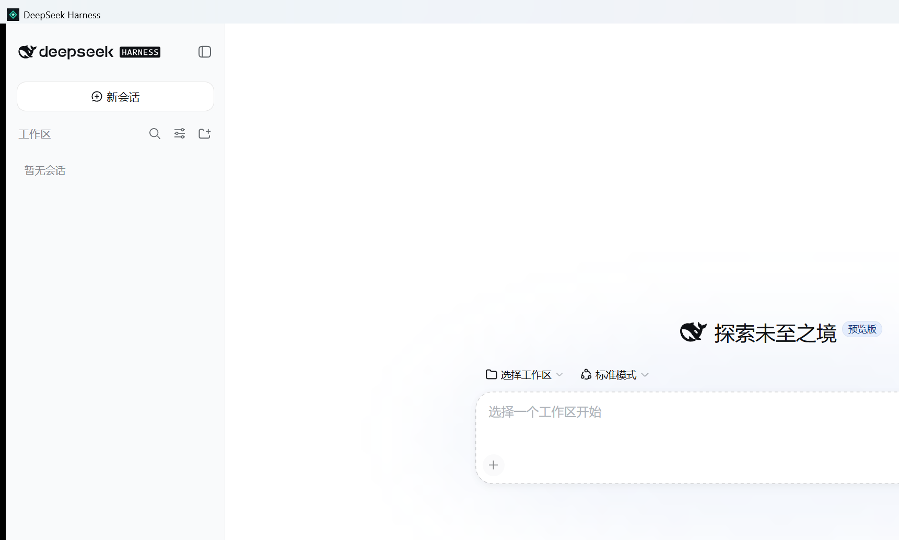

# DeepSeek Harness Desktop

English | [中文](README.zh.md)

A community-maintained Windows desktop distribution of [DeepSeek Harness](https://github.com/deepseek-ai/deepseek-harness), with a native window, one-click installer, private bundled runtime, and no terminal to keep open.

> This repository is maintained by [`evanmormmm`](https://github.com/evanmormmm) and is not an official DeepSeek release. DeepSeek Harness is developed by [DeepSeek AI](https://deepseek.com) and remains available under the [MIT License](LICENSE).

[**Download the latest Windows installer →**](https://github.com/evanmormmm/deepseek-harness-desktop/releases/latest)



## What you get

- **Double-click startup:** launch from the Start menu or desktop without PowerShell, pnpm, or a browser tab.
- **Native lifecycle:** one WinForms/WebView2 window owns one private Harness backend and shuts it down when the window closes.
- **Existing Harness features:** sessions, workspaces, plugins, tools, permissions, model settings, and `$DSH_HOME` data work through the upstream Web UI.
- **Windows release assets:** each release provides an installer, a portable ZIP, and `SHA256SUMS.txt`.
- **Verified packaging:** the release build tests the deployed backend, real WebView page load, graceful shutdown, silent installation, and uninstallation.

<a id="run"></a>

## Install

1. Open the [latest release](https://github.com/evanmormmm/deepseek-harness-desktop/releases/latest).
2. Download `DeepSeek-Harness-Desktop-<version>-win-x64-Setup.exe`.
3. Verify it against `SHA256SUMS.txt`, run the installer, then open **DeepSeek Harness** from the Start menu.
4. Open **Settings → Models** to add your DeepSeek API key, then choose a workspace and create a session.

The current community binaries are not Authenticode-signed, so Windows SmartScreen may identify the publisher as unknown. See the [illustrated Windows guide](apps/desktop/README.md) for screenshots, the portable edition, prerequisites, architecture, removal, troubleshooting, and source builds.

## Architecture

The native host embeds the existing Harness Web client instead of creating another chat implementation. It starts the bundled Node runtime on exact IPv4 loopback with a random port, validates the child and HTML endpoint, gives WebView2 access to that one origin, and joins bounded profile disposal on close.



<a id="run-from-source"></a>

## Build from source

```powershell
pnpm install --frozen-lockfile
pnpm run desktop:build
pnpm run desktop:package
```

The release assets are written to `.artifacts/desktop-release/`. Development requires Windows x64, Node `^22.19 || >=24`, pnpm, the .NET 8 SDK, WebView2 Runtime, and Inno Setup 6. Installed users do not need the development toolchain.

## Upstream and maintenance

This repository preserves the upstream Git history and keeps `upstream` pointed at [`deepseek-ai/deepseek-harness`](https://github.com/deepseek-ai/deepseek-harness). The desktop host is intentionally a thin product layer under `apps/desktop`; upstream Harness packages remain structurally unchanged apart from the desktop process entry required to boot the assembled Web profile.

For Harness architecture and plugin development, read [AGENTS.md](AGENTS.md), the [development guide](docs/development.md), and the [architecture documentation](docs/architecture.md).

## License

[MIT](LICENSE). Third-party dependencies and their licenses are disclosed in [THIRD_PARTY_NOTICES.md](THIRD_PARTY_NOTICES.md) and in each desktop release.
