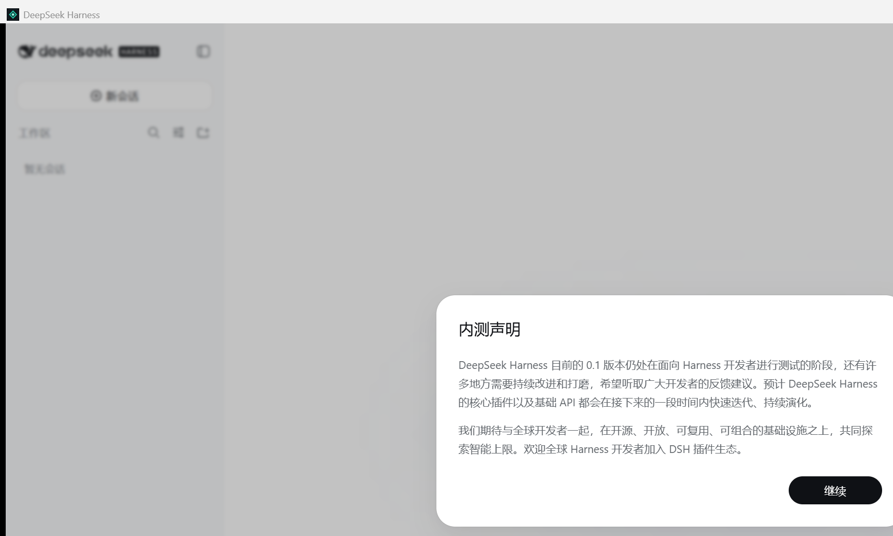
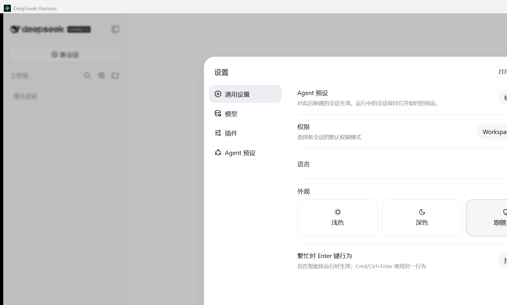

# DeepSeek Harness Desktop for Windows

English | [中文](README.zh.md)

> **Community Windows distribution.** This desktop host is maintained in [`evanmormmm/deepseek-harness-desktop`](https://github.com/evanmormmm/deepseek-harness-desktop) and is not an official DeepSeek release. The Harness source remains MIT-licensed and tracks [`deepseek-ai/deepseek-harness`](https://github.com/deepseek-ai/deepseek-harness).

The Windows desktop application hosts the existing DeepSeek Harness Web UI in a native WebView2 window. Double-clicking the app starts a private Harness process on an operating-system-assigned loopback port; closing the window saves the native placement, disposes the profile, and waits for the backend process to exit. No terminal or browser tab stays open.


## Install in three steps

### 1. Download the installer

Open the [latest GitHub Release](https://github.com/evanmormmm/deepseek-harness-desktop/releases/latest) and download `DeepSeek-Harness-Desktop-<version>-win-x64-Setup.exe`. `SHA256SUMS.txt` on the same page contains the checksum. The installer is currently unsigned, so Windows SmartScreen may show an unknown-publisher prompt; use the checksum to verify the downloaded file before running it.

The installer requires Windows 10 version 1809 or later on x64. Windows 11 normally includes the Microsoft Edge WebView2 Runtime; install the [Evergreen Runtime](https://developer.microsoft.com/en-us/microsoft-edge/webview2/) if startup reports that WebView2 is missing. Node.js, pnpm, PowerShell, and the .NET SDK are bundled or unnecessary for installed use.

### 2. Complete first launch

Launch **DeepSeek Harness** from the Start menu. Read the developer-preview notice and select **Continue**.



### 3. Add a model and workspace

Open **Settings → Models**, add a DeepSeek provider, and enter your own API key. The key is stored by the existing Harness credential provider under `$DSH_HOME` (default `~/.dsh`); the desktop lifecycle log does not record credentials or model request bodies.



Return to the home screen, select **Choose workspace**, and pick a project directory. That directory becomes the immutable cwd and `workspace-write` root for each new session. Create a session and start using Harness.

## What the desktop host changes


The desktop layer owns only presentation and process lifecycle:

- **One window, one backend.** A second launch activates the existing window instead of starting another server.
- **Private random address.** Every run binds exact IPv4 loopback on an operating-system-assigned port; another local port cannot navigate inside the privileged WebView.
- **Bounded shutdown.** Closing, updating, or uninstalling first requests profile disposal and waits for the owned Node process. Forced process-tree termination is the timeout fallback.
- **Existing Harness behavior.** Models, sessions, credentials, plugins, permissions, tools, and workspaces remain owned by the upstream Harness profile in `$DSH_HOME`.
- **External navigation isolation.** Ordinary non-loopback `http`, `https`, and `mailto` links open through Windows; `file`, `data`, script schemes, and other loopback origins are blocked.

The editable diagram source is [`desktop-architecture.mmd`](assets/diagrams/desktop-architecture.mmd).

## Portable edition and removal

The Release also contains `DeepSeek-Harness-Desktop-<version>-win-x64.zip`. Extract the whole directory before launching `DeepSeek Harness.exe`; the adjacent `runtime` directory is required. Portable and installed editions intentionally share the same `$DSH_HOME` unless that environment variable selects another location.

Remove the installed edition through **Windows Settings → Apps → Installed apps → DeepSeek Harness Desktop**. Uninstall removes the application and shortcuts but preserves Harness credentials, settings, sessions, plugins, workspace records, and WebView data. Delete `~/.dsh` and `%LOCALAPPDATA%\DeepSeek Harness` separately only when you intend to erase that state.

## Build and package from source

Prerequisites are Windows x64, Node `^22.19 || >=24`, pnpm, the .NET 8 SDK, the Microsoft Edge WebView2 Runtime, and Inno Setup 6 for release packaging.

```powershell
pnpm install --frozen-lockfile
pnpm run desktop:build
pnpm run desktop:package
```

`desktop:build` builds Harness, runs desktop unit and built-adapter lifecycle tests, publishes the self-contained .NET host, deploys the production Harness closure, and verifies the packaged backend and WebView lifecycle. Its portable output is `.artifacts/DeepSeek-Harness-Desktop/`.

`desktop:package` compiles the installer and portable ZIP under `.artifacts/desktop-release/`, silently installs to an isolated directory, launches the installed app in WebView smoke mode, requires graceful backend exit, uninstalls it, and writes `SHA256SUMS.txt`.

For a local user installation from the verified directory:

```powershell
pnpm run desktop:install
```

For the script-based local installation only, remove the installed copy and shortcuts while preserving `$DSH_HOME`:

```powershell
pwsh -NoProfile -File scripts/uninstall-desktop-windows.ps1
```

## Runtime and troubleshooting

The distribution contains `runtime/node/node.exe` and a symlink-free production deployment at `runtime/harness`. The host starts `runtime/harness/node_modules/@deepseek-ai/dsh/lib/desktop-bin.js`, validates its process id and exact `http://127.0.0.1:<port>` HTML root, then navigates WebView2. Window close sends `shutdown` over private stdin; after eight seconds the host terminates only its owned process tree.

Diagnostics are appended to `%LOCALAPPDATA%\DeepSeek Harness\logs\desktop.log`. Startup failures show **Retry** and **Open log** actions. `--workspace <absolute-path>` changes the initial fallback workspace, `--runtime <absolute-path>` selects another packaged runtime, and `DSH_DESKTOP_DEVTOOLS=1` enables WebView2 developer tools for debugging.

## Release limitations

- Windows x64 is the only native host target.
- The app relies on the installed Evergreen WebView2 Runtime instead of bundling Chromium.
- Release binaries are reproducibly checked and hashed but are not yet Authenticode-signed.
- Updates are installed from GitHub Releases; there is no in-app auto-updater.
